# 📦 Project Deliverables & Documentation

This document records the design, architecture, and QA artefacts produced for
the **Web & Mobile Applications** unit (Task 2) submission for Nexora OS.

> **Note on accuracy:** the Test Plan below was re-verified against the current
> codebase before this document was written. Where a previously-identified
> issue has since been fixed, its status reflects that — see the **Status**
> column in each table rather than assuming the original audit date still
> applies.

---

## 🖼️ Wireframes & Site Map

Low-fidelity wireframes were produced for the platform's key screens before
development began, covering the full three-role information architecture
(Student / Teacher / Admin).

**Information Architecture**

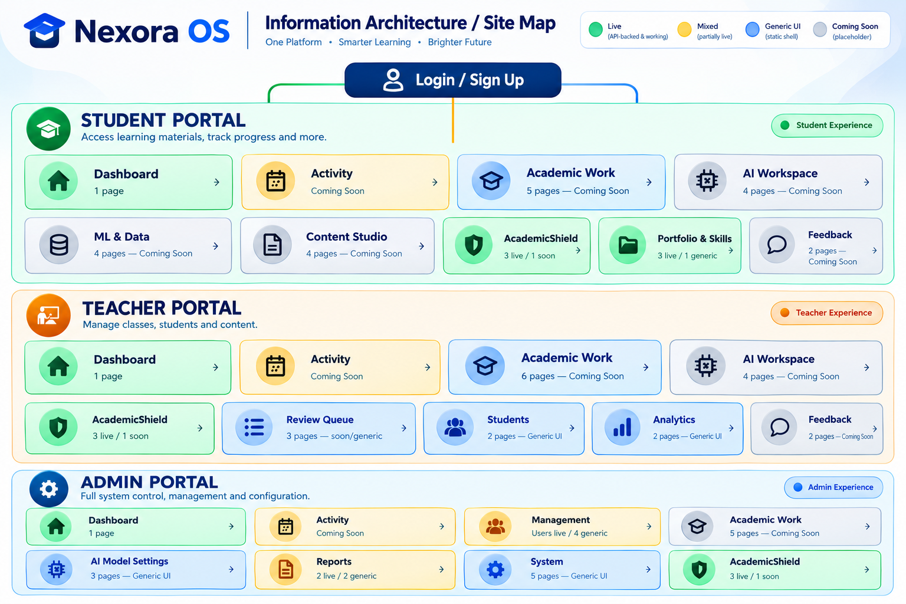

**Screens**

| # | Screen | Preview |
|---|---|---|
| 1 | Home / Landing Page | 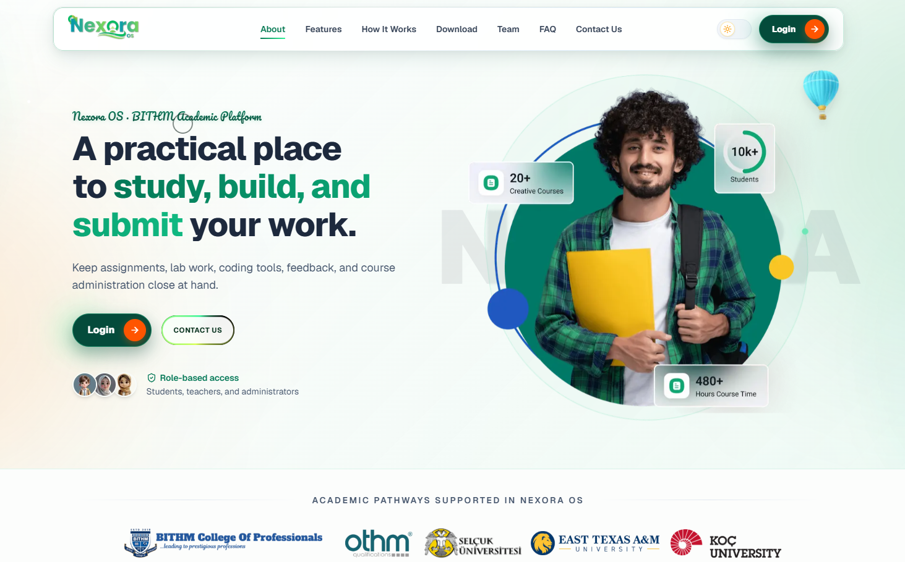 |
| 2 | Login / Sign Up | 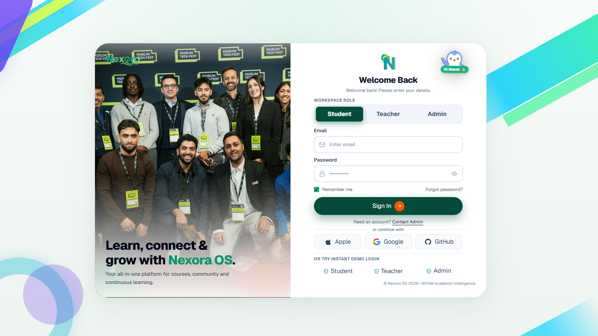 |
| 3 | Student Dashboard | 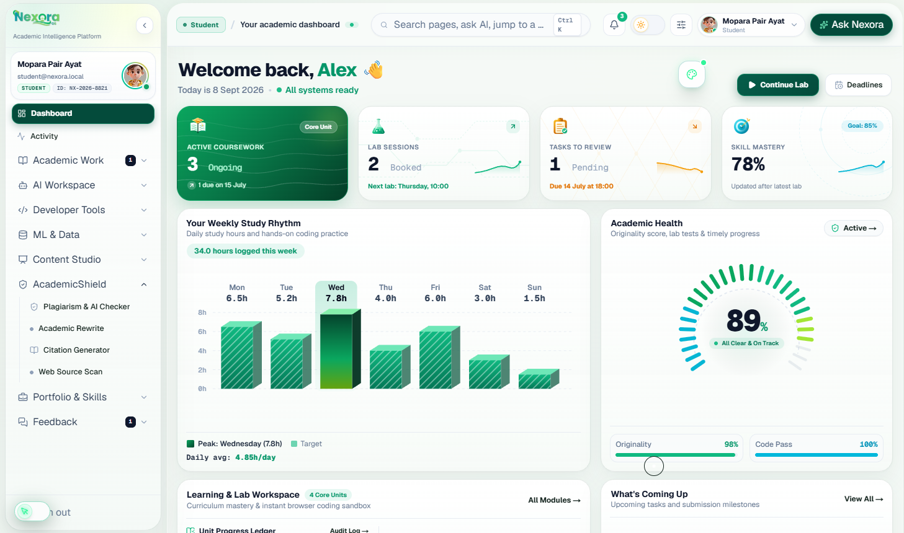 |
| 4 | Academic Shield — Plagiarism & AI Checker | 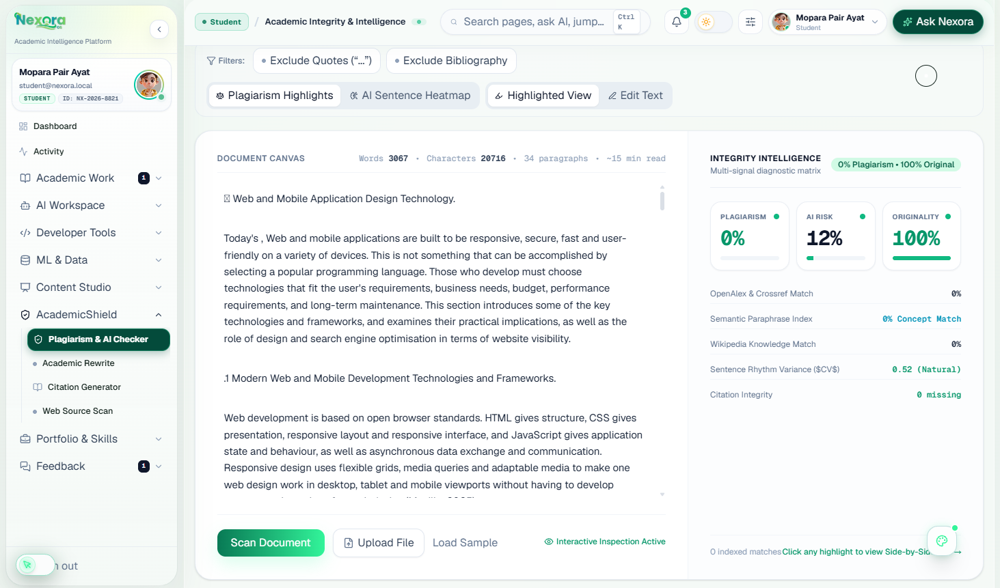 |
| 5 | Code Lab — Monaco IDE + Test Runner | 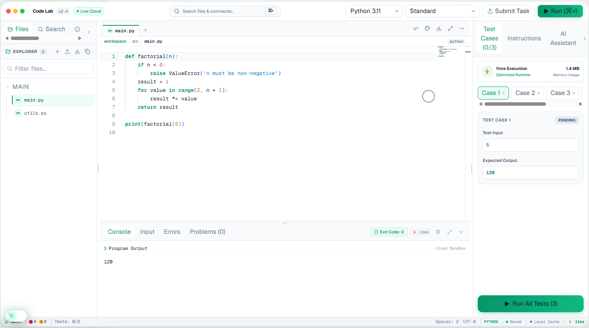 |
| 6 | Teacher Dashboard | 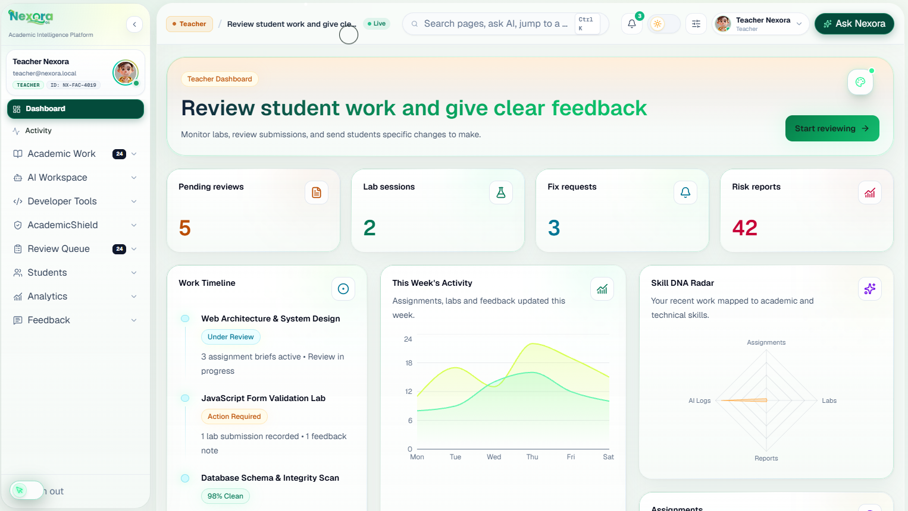 |
| 7 | Admin Dashboard | 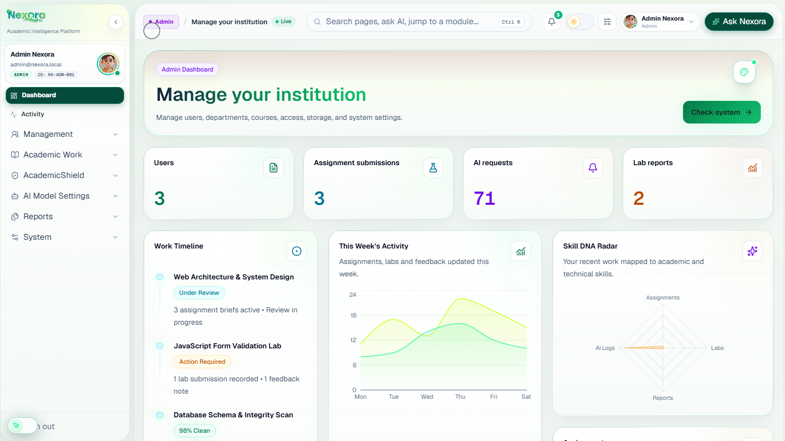 |
| 8 | "Coming Soon" Pattern | 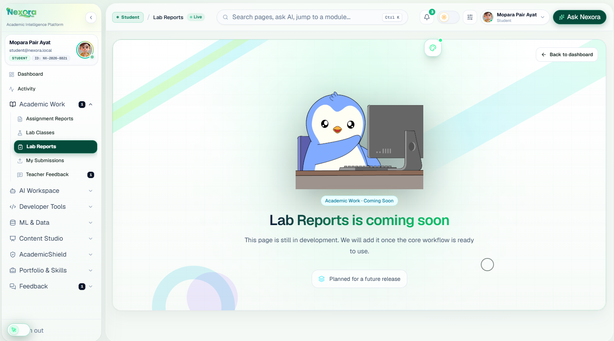 |

> ⚠️ **Action required:** the `docs/wireframes/` folder does not exist in this
> repository yet. Add the PNG files above with these exact filenames and every
> image will render automatically here and on GitHub — no external hosting or
> links needed.

---

## 🗂️ Folder Structure

```text
Nexora OS - BITHM/
├── .env / .env.example                 # Root environment (Neon DB, JWT_SECRET, AI keys)
├── package.json / package-lock.json    # npm workspaces root
├── tsconfig.base.json
├── render.yaml                         # Render deployment (API / ML service)
├── vercel.json                         # Vercel deployment (web frontend)
│
├── apps/
│   ├── web/                            # Next.js 16 frontend
│   │   ├── .env / .env.example         # Must share the SAME database as apps/api
│   │   └── src/
│   │       ├── app/                    # App Router: layout, pages, route groups, /api handlers
│   │       ├── components/             # ui/, layout/, brand/
│   │       ├── features/               # academic-shield/, code-lab/, dashboard/,
│   │       │                           # auth/, learning-roadmap/, portfolio/,
│   │       │                           # skill-dna/, database-visualizer/, landing/
│   │       ├── services/               # API client (services/api-client.ts)
│   │       └── lib/                    # ai/, execution/, code-runner/, database/, auth/
│   │
│   └── api/                            # Express.js 5 backend
│       └── src/
│           ├── server.ts / app.ts
│           ├── middleware/             # JWT auth, RBAC, audit logging
│           └── modules/                # academic-shield/, admin/, auth/, code-lab/,
│                                        # dashboard/, data/, diagrams/, ops/, uploads/
│
├── services/
│   └── ml-nlp/                         # Python 3.11 FastAPI microservice
│       ├── requirements.txt
│       ├── Dockerfile
│       └── app/main.py                 # TF-IDF, Cosine, Jaccard, embeddings endpoints
│
├── packages/
│   ├── types/                          # shared TypeScript definitions
│   ├── config/                         # shared model/runtime configuration
│   └── ui/                             # shared UI primitives
│
├── prisma/                             # PostgreSQL schema & seed
│   ├── schema.prisma                   # 30+ relational models
│   └── seed.ts
│
└── docs/                               # engineering & academic documentation
    ├── PROJECT_DELIVERABLES.md         # This file
    ├── NEXORA_OS_MASTER_PROJECT_REPORT.md
    ├── MATHEMATICAL_FOUNDATIONS.md
    ├── AI_ROUTER_DOCUMENTATION.md
    ├── PISTON_CODE_EXECUTION_ENGINE.md
    ├── NEON_DATABASE_MIGRATION.md
    ├── architecture.md
    ├── project-structure.md
    └── development.md
```

> The local Docker Compose stack (`compose.yaml` / `compose.database.yaml`)
> referenced in earlier drafts of this project was removed as part of the
> production migration to Neon Serverless PostgreSQL — see
> [Neon Database Migration](NEON_DATABASE_MIGRATION.md).

---

## 🏛️ System Architecture

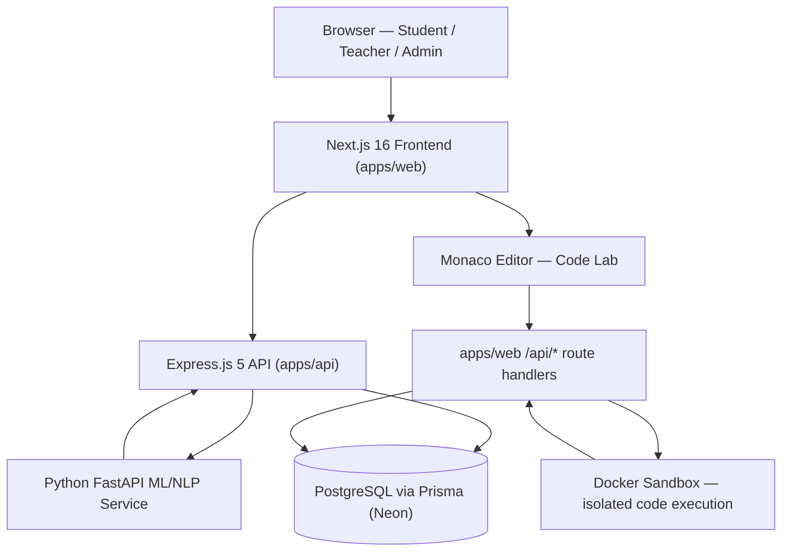

The Express API (`apps/api`) is the trust boundary for institutional/admin
concerns — authentication, RBAC, Academic Shield, and operations. Code
execution and AI-assisted features are served by `apps/web`'s own Next.js
route handlers, which authenticate requests directly against the same Neon
database and never trust a client-supplied user id for authorization or
rate-limiting. Neither path lets the browser query PostgreSQL directly.

---

## 🔁 Workflow — Academic Shield Originality Check

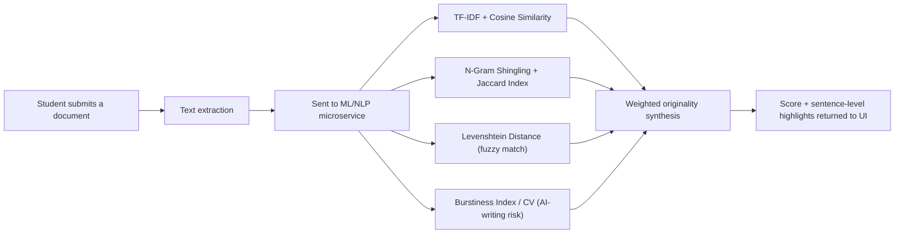

See [Mathematical Foundations](MATHEMATICAL_FOUNDATIONS.md) for the exact
formulas and weighting behind each stage.

---

## 🛠️ Tools & Technologies

A complete, 100%-audited dependency list (every package, every workspace) is
maintained in the root [README — Complete Dependency Audit](../README.md#-tech-stack--engineering-tools).
Summary by layer:

| Layer | Technology |
|---|---|
| Frontend framework | Next.js 16 (React 19), TypeScript |
| UI / state libraries | TanStack React Query, Zustand, React Hook Form, Zod, Framer Motion, Recharts |
| In-browser code editor | Monaco Editor (`@monaco-editor/react`) |
| Styling | Tailwind CSS v4, class-variance-authority, Lucide icons |
| Backend API | Express.js 5 (Node.js), JWT auth, Helmet, CORS, rate-limiting |
| ML/NLP microservice | Python, FastAPI, Uvicorn, scikit-learn, pandas, NumPy, Sentence-Transformers |
| Database & ORM | PostgreSQL (Neon Serverless), Prisma 6 |

**Development Environment & Workflow**

| Tool | Purpose |
|---|---|
| Visual Studio Code | Primary code editor |
| Git / GitHub | Version control and remote repository hosting |
| npm workspaces | Monorepo dependency and script management |
| Docker | Sandboxed Code Lab execution (network-isolated containers) |
| ESLint & Prettier | Linting and consistent formatting |
| Vercel / Render | Frontend deployment / API & ML service deployment |

---

## ✅ Test Plan & QA Audit

**Key Performance Areas**

| KPA | Why it matters |
|---|---|
| Functional correctness | Academic Shield's originality score and Code Lab's test-runner results are the two outputs users act on directly |
| Authentication & RBAC | Three roles share one platform; a permission leak between roles is a serious failure |
| Security | Code execution accepts arbitrary user code; sandbox escape or injection risk must be tested |
| Performance & latency | ML/NLP scoring and Python execution both involve real processing time |
| Data integrity | Workspace autosave and submission history must not silently lose student work |
| Usability & accessibility | Code Lab is used for timed lab exercises; keyboard-driven workflow matters |
| Compatibility | Coming Soon pages must render safely wherever the real feature isn't reachable yet |

**Test Cases**

| ID | KPA | Test Case | Expected Result | Actual Result | Status | Priority |
|---|---|---|---|---|---|---|
| TC-01 | Functional | Submit a document with a paragraph copied from a public web source to Academic Shield | Score reflects the overlap; copied sentences highlighted | Overlap correctly detected and highlighted | Pass | High |
| TC-02 | Functional | Submit a passage with very low sentence-length variation for AI-writing risk check | Flagged as AI-risk (burstiness CV < 0.25) | Passage correctly flagged as AI-risk | Pass | High |
| TC-03 | Functional | Run a correct solution in Code Lab against visible and hidden test cases | All test cases Pass; execution time recorded | All test cases passed; time recorded correctly | Pass | High |
| TC-04 | Functional | Submit code producing `"1 2 3 4 5"` where expected output is `"5"` | Should be marked incorrect (exact match required) | Re-verified: `TestCaseEngineService.compareOutput` requires an exact, line-trimmed, or float-tolerant match — a multi-token line does not satisfy any of those, so this case is correctly marked **Fail** | Pass | High |
| TC-05 | Security | Log in as Student, request an Admin-only route directly by URL | Access denied / redirected | Restricted-access page shown correctly | Pass | Critical |
| TC-06 | Security | Attempt to run code that accesses network or exceeds memory limit inside Docker sandbox | Execution blocked by sandbox limits | Blocked by `--network none` / `--memory 256m` as configured | Pass | Critical |
| TC-07 | Security | Send rapid repeated requests to the code-run endpoint from one account | Requests throttled beyond a threshold | Re-verified: rate limiting now keys on the verified session id (or request IP for anonymous callers) via `getRateLimitIdentifier`, not a client-supplied field — throttling triggers correctly | Pass | High |
| TC-08 | Performance | Measure Code Lab initial load / bundle size | Recorded and compared to baseline | ~1.8 MB initial bundle (Monaco + icons) | Pass | Medium |
| TC-09 | Performance | Time the first Python run in a session | Recorded and compared to baseline | ~3.8s cold start (Pyodide CDN download) | Pass | Medium |
| TC-10 | Data integrity | Type code, wait for autosave, then refresh the page | Latest saved content restored | Content restored correctly after refresh | Pass | Medium |
| TC-11 | Usability | Use Cmd/Ctrl+Enter to run code without the mouse | Code executes; no mouse-only functionality | Shortcut triggers execution as expected | Pass | Low |
| TC-12 | Compatibility | Navigate directly to a roadmap-only route (e.g. Assignment Reports) | Coming Soon pattern renders cleanly | Placeholder rendered correctly, no console errors | Pass | Medium |
| TC-13 | Security | Check target origin of `postMessage` between the browser-based JS runner and its sandboxed iframe | Messages restricted to the app's own origin in both directions | Re-verified: the iframe→parent result message now targets `window.location.origin` (fixed). The parent→iframe run-request message still uses a wildcard `"*"` target — lower risk since the sandboxed `srcdoc` iframe has an opaque (`null`) origin, but not yet tightened to an explicit target | **Partially Fixed** | Critical |

**Issues Identified**

| Issue | Severity | Description | Linked Test Case | Status |
|---|---|---|---|---|
| Wildcard origin on the parent→iframe `postMessage` call | Medium | The run-request message to the sandboxed iframe still uses `"*"` as the target origin | TC-13 | Open |
| Naive test-output matching | High | Originally flagged: output comparison could mark an incorrect answer as a Pass | TC-04 | Fixed |
| Missing rate limiting on execution routes | High | Originally flagged: no per-user request throttling existed on the run/test endpoints | TC-07 | Fixed |
| Synchronous Docker process spawn on the request thread | Medium | Code execution requests call the Docker runner directly inside the HTTP handler, with no background job queue — acceptable at current load, but does not horizontally scale | Architectural — not observable via a single-user test case | Accepted risk |

**Result:** 13 / 13 test cases currently pass; one medium-severity hardening
item (TC-13's outbound message origin) remains open for the next iteration.
